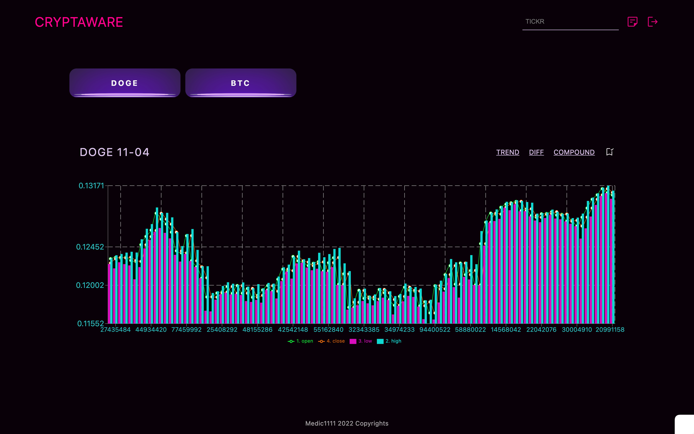
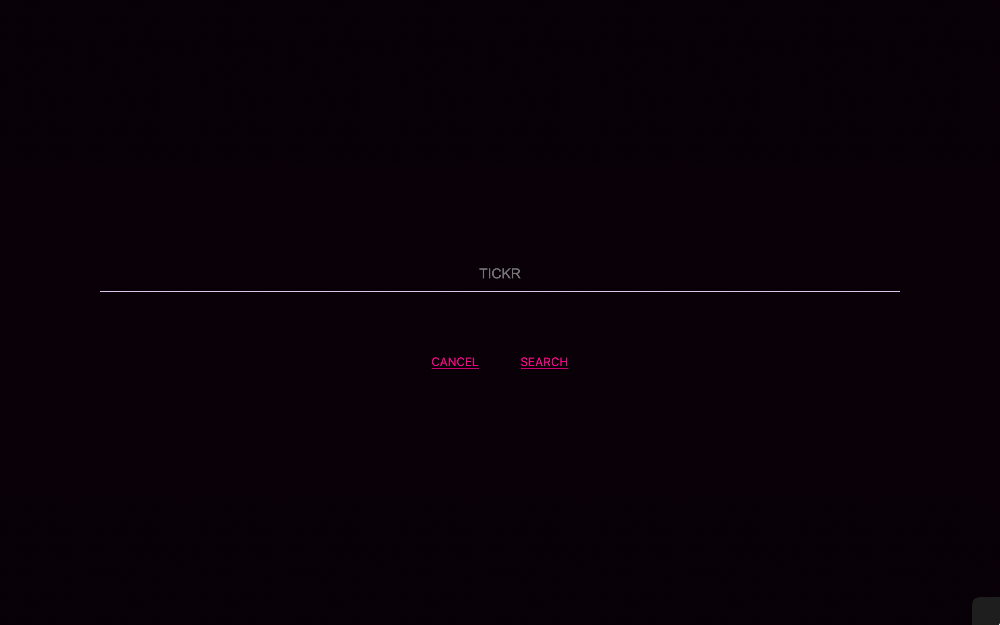
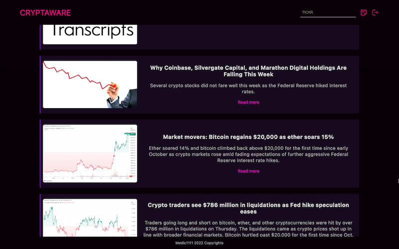

# CRYPTAWARE-FULL-STACK

---

[Dev is live here](https://cryptaware.onrender.com/)

---

Crypto-currency tracker build with React in Typescript. User may search for the intraday data for crypto-currencies of choice, bookmark favorites, and access latest enws.

> Client-only versions available in JS and TS. Check my repos. [Client-only-TS](https://github.com/Medic1111/CRYPTAWARE_TYPESCRYPT_CLIENT) or [Client-only-JS](https://github.com/Medic1111/CRYPTAWARE)

## QuickGuide

- [Tech](#tech)
- [Testing](#testing)
- [Run with it](#run-with-it)
- [Developer](#developer)

### TECH

- Client
  - React.js/TypeScript
    - Recharts
    - AlphaVantage API
- Database
  - MongoDB
- Server
  - NodeJS
  - Express
- Deploy
  - Render.io

---

### TESTING

1. Click on the live link
2. Testing Credentials are:
   - Username: medic1111
   - Password: 111111
3. Please keep in mind I use the free plan of Alphavantage API, allowing for 6 calls a minute only. Chances are, you will get to the limit and eventually receive a 500.

---

### RUN WITH IT

1. Fork Repo
2. Run `npm install` to install all dependencies
3. Run `node server/app.js` to spin the server (nodemon alternatively if you have it installed)
4. Then `cd client` and `npm install`
5. To run the client, `npm start`
6. Get an api key at [alphavantage](https://www.alphavantage.co/)
7. On the root, create a `.env` file and add your api key with as: `REACT_APP_API_KEY="your_key_here_between_quotes"`
8. Also add `SECRET_STRING="Choose your string in between quotes"`
9. Finally, add to `DB_URI= your_mongo_db_URI_without_quotes`

---

### DEVELOPER

**:point_right: Aryse Tansy**
:e-mail: paganowebdev@gmail.com
:computer: [Portfolio](https://www.pagano.dev/)

---
